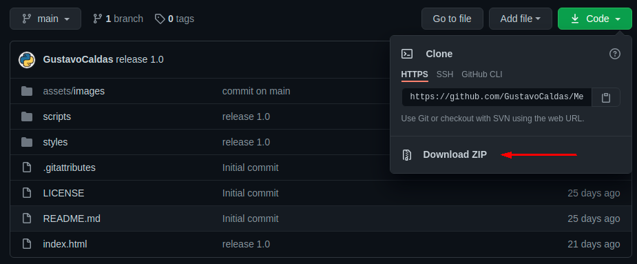

## Jogo da memória
#### Este projeto foi desenvolvido utilizando linguagem HTML CSS e JS.
#### Trata-se de um jogo da memória utilizando cartas de tecnologias front-end.

#### Caso queira experimentar basta clonar o repositório para a sua máquina ou simplesmente baixar o arquivo .ZIP

#### E executar o arquivo index.html conforme abaixo.

